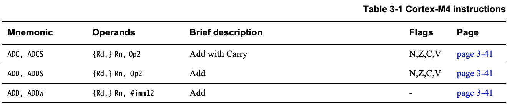

# ARM Assembly Primer

While it's impossible to give a meaningful overview of ARM assembly in a single
brief document, this primer aims to serve as a crash course or reminder of some
of the key concepts in ARM Thumb or Thumb-2 assembly language programming.

The main target of this primer is **ARM Cortex-M** devices, which employ
several different versions of the ARM architecture and instruction set,
depending on the device selected:

| Instruction Set    | Associated ARM Cortex Device(s)              |
| ------------------ | -------------------------------------------- |
| ARMv6-M (Thumb)    | ARM Cortex M0, ARM Cortex-M0+, ARM Cortex-M1 |
| ARMv7-M (Thumb-2)  | ARM Cortex-M3                                |
| ARMv7E-M (Thumb-2) | ARM Cortex M4(F), ARM Cortex M7              |
| ARMv8-M (Thumb-2)  | ARM Cortex M23, ARM Cortex M33               |
| ARMv8.1M (Thumb-2) | ARM Cortex M55                               |

- **ARMv6-M** cores are small and very power-efficient cores.
- **ARMv7-M** provides higher performance, additional addressing mode,
conditional execution, bit field processing, and multiple and accumulate (MAC)
hardware support.
- **ARMv7E-M** adds 32-bit SIMD operations and, optionally, a floating-point
unit with single-precision on the M4 or M7, or double-precision on the M7.
M7 is superscalar and support tightly-coupled memory (TCM) and caches.
- **ARMv8-M** adds TrustZone support for HW isolation of secure and non-secure
processing environments.
- **ARMv8.1-M** adds a vector ISA (Helium), half-precision floating point
support, and performance monitoring unit (PMU) for enhanced debugging.

For technical resources on the various architectures see:

- [DDI0419: ARM v6-M Architecture Reference Manual](https://developer.arm.com/documentation/ddi0419/latest/)
- [DDI0403: ARM v7-M Architecture Reference Manual](https://developer.arm.com/documentation/ddi0403/latest/)
- [DDI0553: ARM v8-M Architecture Reference Manual](https://developer.arm.com/documentation/ddi0553/latest/)

For a comprehensive treatment on the subject see:

- [Modern Assembly Language Programming with the ARM Processor](https://www.elsevier.com/books/modern-assembly-language-programming-with-the-arm-processor/pyeatt/978-0-12-803698-3),
Larry D. Pyeatt (Newnes, 2016)
- [ARM Assembly Language, 2nd Edition](https://www.oreilly.com/library/view/arm-assembly-language/9781482229851/),
William Hohl (CRC Press, 2016)

For summaries of instruction sets see:

- [ARM and Thumb-2 Instruction Set Quick Reference Card](https://developer.arm.com/documentation/qrc0001/m) (Armv7-M, Armv8-M.mainline, etc.)
- [Thumb 16-bit Instruction Set Quick Reference Card](https://developer.arm.com/documentation/qrc0006/e) (Armv6-M [M0], Armv8-M.baseline [M23], etc.)

For exhaustive details of instructions see:

> For Cortex-M devices, you will usually need to look at the 16-bit Thumb
  version of instructions, taking into the specific limitations.

- [Arm Compiler armasm Reference Guide](https://developer.arm.com/documentation/dui0802/b)

## ARM User Registers

Like most modern processor designs, ARM cores require that values be stored in
local general-purposes registers before they can be operated upon.

#### General Purpose Registers

ARM processors have 13 general-purpose 32-bit registers (`r0` through `r12`),
and three special-purpose 32-bit registers (`r13-r15`):

> Register aliases are sometimes encountered in code, where `A` indicates the
  four caller-saved function arguments, and `V` indicates the eight callee-saved
  variables arguments.

|Register|Description|Alias|
|--------|-----------|-----|
|R0| General-purpose register 0 |`a1`|
|R1| General-purpose register 1 |`a2`|
|R2| General-purpose register 2 |`a3`|
|R3| General-purpose register 3 |`a4`|
|R4| General-purpose register 4 |`v1`|
|R5| General-purpose register 5 |`v2`|
|R6| General-purpose register 6 |`v3`|
|R7| General-purpose register 7 / Thumb work register in function entry/exit |`v4`, `wr` ([Thumb][TRPC])|
|R8| General-purpose register 8 |`v5`|
|R9| General-purpose register 9 |`v6`|
|R10| General-purpose register 10 |`v7`|
|R11| General-purpose register 11 / Frame pointer|`v8`, `fp`|
|R12| General-purpose register 12 / Inter-procedure scratch register|`ip`|
|R13| Stack pointer |`sp`|
|R14| Link register |`lr`|
|R15| Program counter |`pc`|

[TRPC]: https://developer.arm.com/documentation/dui0041/c/Thumb-Procedure-Call-Standard/TPCS-definition/TPCS-register-names?lang=en

The three main special purpose registers are:

- The **stack pointer** (`R13`) holds the address where the stack currently
  ends. As stack usage increases, this number will decrease towards the top
  of the stack (though logically it seems like the bottom since the stack
  'grows' downward).
- The **link register** (`R14`) contains the return address for subroutines,
  which usually holds the `pc` value from the previous function call so that
  the application can return to the calling address once execution of the
  function has completed.
- The **program counter** (`R15`) contains the address of the next instruction
  to be executed by the ARM core. This register will be incremented before
  an instruction is executed, enabling sequential program flow unless
  a different value is written to this register, causing the code to jump to
  the new address. **With Thumb instructions, `PC` is always ahead by 4
  bytes.**

Additionally, there are two registers that are used by high-level
languages by convention, though this isn't mandatory in assembly:

- The **frame pointer** (`R11` for Arm, `R7` for Thumb) is used by the
  compiler to store the value of the stack just before the function is
  called. It points to the top of the frame. From the value of the fp
  down to the value of the sp is the “frame” that is allocated for the
  function call. The frame pointer has the same value throughout the
  execution of the function, so all local data can be accessed via
  hard-coded offsets from the FP.
- The **inter-procedure scratch register** (`R12`) is used by the C library
  when calling DLL functions.

#### Current Program Status Register (CPSR)
In addition to the 15 standard user registers, there is an additional register
of note called the `CPSR` (Current Program Status Register):

|Register|Description|
|--------|-----------|
|CPSR| Current Program Status Register |

This register is used in combination with the `s` modifier (see 
**Mnemonic Formation** below), storing information about the results of the
modified command in the `CPSR` register after the fact. The value held in
this register can then control whether certain instructions are executed or
not, such as running one command if the result was 0, and another if it was not.

This information is only easily accessible in assembly.

The CPSR has four key **condition flag bits** that make up the upper four bits
of the register:

| Bit | Name | Description |
|-----|------|-------------|
| 31  | **N** | **(Negative)** 1 = signed result is negative, 0 = positive or zero |
| 30 | **Z**  | **(Zero)** 1 = result is zero, 0 = result is non-zero |
| 29 | **C**  | **(Carry)** 1 if an `add` operation resulted in a carry out of the MSB or if a `sub` operation resulted in a borrow |
| 28 | **V**  | **(Overflow)** Set to 1 if a signed `add` or `sub` overflow occured |

> For further details on the other CPSR bits, consult the official ARM
  documentation or one of the ARM assembly books mentionned in this guide. It's
  an important and frequently used register that you'll need to properly
  understand to work with ARM assembly.

## ARM Instructions

An ARM assembly instruction is made up of a short **mnemonic** (a short string
representing a base instruction plus any optional modifiers), and a set of
**operands**, which can be either registers or constants.

The image below, for example, shows the `ADD` mnemonic family, along with it's
operands, and is taken from section 3.1 of  *Cortex-M4 Instruction Set* from
ARM:



Above you can see the **condition flags** modified by the `s` variant of these
commands (see *The s Modifier* below for details), the list of operands
associated with the said mnemonics, and some notes on what the specific
mnemonic does.

Operands and mnemonic formation are discussed in more detail in subsequent
sections.

### Instruction Types

Before discussing the use of ARM instructions, though, it's important to note
that there are two main *types* of instructions on the ARM processor, and by
design they are rigidly separated from one another:

- **Load/Store** instructions that **move data from the CPU to memory or back**.
- **Data-processing** instructions that **perform computation**

Load/store operations can work with up to 32-bits of data in 8, 16 or 32-bit
chunks, transferring values to and from registers and memory.

Data-processing instructions are performed via two **source operands** and one
**core register** (`R5`, `R8`, etc.). Data-processing instructions operate on
the assumption that the core register(s) already contain data, generally moved
into the register via a load instruction, or pushed out to memory via a store
instruction.

It's important to keep these two instruction types in mind, since they have
consequences in the discussion below.

### Mnenomic Formation

Individual ARM mnemonics are actually a composite of up to three parts:

1. The base instruction (ex. `add`)
2. An optional **s modifier** (ex. `adds`)
3. An optional **condition modifier** (ex. `addeq`)

> NOTE: The two optional modifiers can also be combined (i.e.. `addseq`).

This system of a base instruction plus up to two modifiers allows for a rich
and flexible set of operations, using a relatively restrained number of overall
instructions.

#### 1. The Base Instruction

The base instruction is self-explanatory, and is fully detailed in the
appropriate *Cortex-M<x> Instruction Set* document from ARM.

The more important concept to explore here is the two optional **modifiers**
that can be added to this base instruction, detailed below.

#### 2. The s Modifier

The **s modifier** is related to the `CPSR` register discussed above. By
default `CPSR` will not be used when executing individual instructions, but you
can append the `s` modifier to an assembly command, which will cause the core
to enable usage of `CPSR` for that instruction.

For example, the `add` command will add two 32-bit values. If you append the
`s` modifier to the command -- resulting in `adds` -- the condition
code flags will also be updated based on the result of the operation.

#### 3. Condition Modifiers

There are also a number of two-letter **condition modifiers** that are
employed by appending them to the base instruction mnemonic:

> **Condition Flags** refer to the bits in the `CSPR` register, described
  earlier in this document.

| Cond Code | Condition Flags  | Meaning for data instructions |
|-----------|------------------|-------------------------------|
| `EQ`      | Z = 1            | Equal                         |
| `NE`      | Z = 0            | Not equal                     |
| `CS`/`HS` | C = 1            | Carry condition flag set      |
| `CC`/`LO` | C = 0            | Carry condition flag clear    |
| `MI`      | N = 1            | Negative                      |
| `PL`      | N = 0            | Positive or zero              |
| `VS`      | V = 1            | Overflow set                  |
| `VC`      | V = 0            | Overflow not set              |
| `HI`      | C = 1 and Z = 0  | Unsigned higher               |
| `LS`      | C = 0 or Z = 1   | Unsigned lower or same        |
| `GE`      | N =  V           | Signed greater than or equal  |
| `LT`      | N != V           | Signed less than              |
| `GT`      | Z = 0 and N = V  | Signed greater than           |
| `LE`      | Z = 1 and N != V | Signed less than or equal     |

For example, taking the `add` instruction we could append the `eq` condition
modifier, which would result in an add instruction that **only executes if the
`Z` condition flag in the `CPSR` register is set**.

> Note: Conditional modifiers can **also be combined with the `s` modifier**.

There is one final condition modifier worth mentionning, though it's rarely
seen since this is the default modifier used when nothing else is specified:

| Cond Code | Description                |
|-----------|----------------------------|
| `AL`      | Always (normally ommitted) |

As an example, the code below makes use of the `MI` conditional instruction to
find the absolute value of a number: `R0 = abs(R1)`.

```arm
MOVS  R0, R1      ; R0 = R1, setting flags
IT    MI          ; skipping next instruction if value 0 or positive
RSBMI R0, R0, #0  ; If negative, R0 = -R0
```

> NOTE: The `MI` conditional instruction is actually encoded in machine code by
  means of the `IT MI` statement, not `RSBMI`. For details on how condition
  codes in ASM are actually encoded in machine code, see
  [ARM THUMB Assembly to Machine Code](arm2machine.md).
### Operands

Operands can be either an **immediate value** (a *constant* with specific
constraints), or a **register**.

Registers are relatively self-explanatory, but immediate values may required
some further explanation, given below.

#### Immediate Values

Immediate values in ARM can be constant values that are part of the instruction
itself, or can be accessed from the *literal pool*.

They can be specified in one of the following 8/16/32-bit numeric formats:

- **decimal**
- **octal** (must start with `0`, ex. `03`)
- **hexadecimal** (must start with `0x`, ex. `0x2F`)
- **binary** (must start with `0b`, ex. `0b11010010`)

There are two syntaxes used to specify immediate values in GNU:

1. `=<immediate|symbol>`: Specifies a 32-bit immediate value, or the 32-bit
  value of any symbol in the program. `symbol` can be either program labels (`main`, etc.) or symbols defined via `.equ`, etc. This syntax is used for
  **load/store** instructions.
2. `#<immediate|symbol>`: Can be used to specify values for **data processing**.

> For the distinction between *load/store* and *data-processing* instructions,
  see *ARM Instruction Types* below.

A key restriction of the `=` syntax is that **it can only be used with the
load/store instructions**, never with data-processing instructions, although unlike
the `#` syntax, it can accept more than eight bits of data.

A key restriction of the `#` syntax is that the assembler needs to be able to
construct the value using only:

    - Eight bits of data
    - A shift or rotate operation
    - and/or a complement

Immediate values that can't meet the `#` limitations must be created using a
`ldr` instruction in combinations with the `=<immediate|symbol>` syntax when
indicating the value.


## ARM Instruction Set Summary

The following list isn't exhaustive or definitive, but can be useful to
quickly identify what a specific, commonly used mnemonimic does. Consult the
appropriate ARM Architecture Reference Manual for the definitive mnemonic and
parameter list.

> TODO: Expand with other useful instruction (`REV`, etc.)

| Mnemmonic   | Description |
|-------------|-------------|
| `MOV`       | Move data |
| `MVN`       | Move and negate |
| `ADD`       | Addition |
| `SUB`       | Subtract |
| `MUL`       | Multiplication |
| `LSL`       | Logical shift left (Rn << n) |
| `LSR`       | Logical shift right (Rn >> n) |
| `ASR`       | Arithematic shift right (div by 2, preserves sign bit) |
| `ROR`       | Rotate right (shift right, with wrap around lsb to msb) |
| `CMP`       | Compare |
| `AND`       | Bitwise AND |
| `ORR`       | Bitwise OR |
| `EOR`       | Bitwise XOR |
| `LDR`       | Load |
| `STR`       | Store |
| `LDM`       | Load multiple |
| `STM`       | Store multiple |
| `PUSH`      | Push on stack |
| `POP`       | Pop off stack |
| `B`         | Branch (`PC` relative) |
| `BL`        | Branch w/link storage (`LR`) |
| `BX`        | Branch and exchange |
| `BLX`       | Branch w/link and exchange |

### Example: LDR/STR (Load/Store)

These two instruction are important to understand, since they allow access to
memory addresses outside the standard registers (`R0`, `R7`, etc.). 

Only the `LDR` (load) and `STR` (store) instructions can access memory
directly! All other instructions must move data to `Rn` via `LDR` before
performing any operations on it.

#### LDR Ra, [Rb]

Loads the values at address `Rb`, and assigns it to register `Ra`.

```arm
ldr r2, [r0] # Load the value at address `r0` into `r2`
```

Note that 32-bit constants cannot be encoded in 16-bit Thumb opcodes. This
means that the constant must be stored in the text segment, close to the
referencing instruction, and the value is typically referenced using an offset
relative to the `PC` address (`r15`). 

> **NOTE**: with Thumb instructions, `PC` is always offset by 4 bytes.

When working with stripped files we often have to reassemble these values
ourselves. For example, the following output
compares the same function from the stripped ...

```arm
     454:	4901      	ldr	r1, [pc, #4]	; (0x45e + 0x45c)
     456:	4802      	ldr	r0, [pc, #8]	; (0x462 + 0x460)
     458:	f001 bfb2 	b.w	0x23c0
     45c:	34b2      	adds	r4, #178	; 0xb2
     45e:	1000      	asrs	r0, r0, #32
     460:	34c7      	adds	r4, #199	; 0xc7
     462:	1000      	asrs	r0, r0, #32
```

... and non stripped disassembly:

```arm
10000454 <main>:
10000454:	4901      	ldr	r1, [pc, #4]	; (1000045c <main+0x8>)
10000456:	4802      	ldr	r0, [pc, #8]	; (10000460 <main+0xc>)
10000458:	f001 bfb2 	b.w	100023c0 <printk>
1000045c:	100034b2 			; <UNDEFINED> instruction: 0x100034b2
10000460:	100034c7 	andne	r3, r0, r7, asr #9
```

In this case, `ldr r1, [pc, #4]` points to 0x45C + 0x45E (for a 32-bit value)
because `pc` = 0x454 + 4 = 0x458, then adding the `[#4]` = 0x45E.

0x45C/0x45E isn't an instruction, however, even though the disassembler tries
to understand it as one (resulting in `adds` and `asrs` mnemomnics, which we
should ignore), and the actual meaning is a 32-bit value: `0x100034b2`. The non
stripped output correctly represents 0x45C..0x45E as a single 32-bit
value, although it does still try to parse them into mnemonics.

In this case, `r1` is being assigned a value for use as parameter number two in
the subsequent call to `printk` on line 0x458. `r0` is parameter number one,
and will be passed with the contents at `0x100034c7`.

The original source code for this sequence is shown below, with two parameters
being passed in to `printk`:

```c
void main(void)
{
	printk("Hello World! %s\n", CONFIG_BOARD);
}
```

Other common variants of this command are shown below:

```arm
ldr r0, [r1, #8]  ; Load from address [r1 + 8 bytes]
ldr r0, [r1, #-8] ; Load with negative offset
ldr r0, [r1, r2]  ; Load from address [r1 + r2]
ldr r0, [r2, r1, lsl #2] ; Load from address [r2 + r1 << 2]
```

`LDR` is also often used in relation to pointers in C, with the following
equivalents between assembly and C pointer operations:

- `r1` = `int *intptr = ...;`
- `r0` = `int out;`

```arm
ldr r0, [r1]        ; out = *intptr;
ldr r0, [r1, #4]    ; out = intptr[1];
ldr r0, [r1, #4]!   ; out = *(++intptr); r1 changed before load
ldr r0, [r1], #4    ; out = *(intptr++); r1 changed after load
```

> Other **Addressing Modes** are available for load/store, and should be
  researched on an as-needed basis.

#### STR Ra, [Rb]

Stores the values in register `Ra` at address `Rb`.

```arm
str r2, [r1] # Assign the value of r2 to address `r1`
```

This does the opposite of `ldr`, but has similar constraints in terms of
encoding 32-bit values, and will often be associated with a `ldr` operation
that places a 32-bit value in a register first.

For example, the following implements `__printk_hook_install`:

```arm
     504:	4b01      	ldr	r3, [pc, #4]	; (0x50c)
     506:	6018      	str	r0, [r3, #0]
     508:	4770      	bx	lr
     50a:	bf00      	nop
     50c:	0000      	movs	r0, r0
     50e:	3000      	adds	r0, #0
```

This code first assigns `pc + 4` to `r3`, which resolves is `0x30000000`, then
it stores the input parameter's value (`r0`, as per ARM conventions) into the
address at `r3` (0x30000000). It then branches back to `lr`, which is the
return address for subroutines.

The C code for this function is:

```c
/**
 * @brief Install the character output routine for printk
 *
 * To be called by the platform's console driver at init time. Installs a
 * routine that outputs one ASCII character at a time.
 * @param fn putc routine to install
 *
 * @return N/A
 */
void __printk_hook_install(int (*fn)(int))
{
	_char_out = fn;
}
```

Cheating and looking at the non stripped ELF file in `samples` we can see:

```bash
$ arm-none-eabi-objdump -t samples/lpc55s69_zephyr.elf | grep 30000000
30000000 l    d  .ramfunc       00000000 .ramfunc
30000000 l    d  datas  00000000 datas
30000000 g     O datas  00000004 _char_out
30000000 g     O *ABS*  00000000 CONFIG_SRAM_BASE_ADDRESS
30000000 g       rodata 00000000 _image_ram_start
30000000 g       datas  00000000 __data_ram_start
30000000 g       .ramfunc       00000000 _ramfunc_ram_end
30000000 g       .ramfunc       00000000 _ramfunc_ram_start
```

This shows that `_char_out` is a function stored in SRAM in `.ramfunc`, and is
located at address 0x30000000, at the very top of SRAM, corresponding to the
value we saw above.
