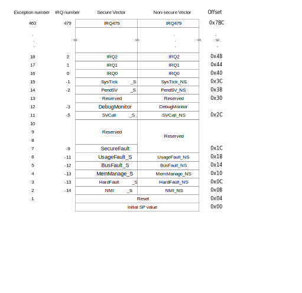

# ARMv8-M Exception Types

Standard ARM exception handlers and triggers.

For the ARMv8-M, the initial 15 vector table entries are described in
[Arm Cortex-M33 Devices Generic User Guide: Vector Table](https://developer.arm.com/documentation/100235/0002/the-cortex-m33-processor/exception-model/vector-table), and shown below:

> NOTE: ARMv8-M processors generally include ARM TrustZone, where both
  Secure (S) and Non-Secure (NS) processing environments exist, and a
  vector table will be present for each processing environment.

## Reset (1)

Invoked on power-up or a warm reset.

When the processor starts, execution restarts fro mthe address that is
provided by the reset entry in the vector table.

## NMI (2)

Non-maskable interrupt.

Signaled by peripheral or triggered in SW. Highest priority interrupt other
than reset. Always enabled.

## HardFault (3)

Occurs due to an error in exception handling, or because of an exception can't
be handled by other exception mechanisms.

A security violation is a non-secure NMI handler would trigger a secure
HardFault exception.

## MemManage (4)

Memory protection related fault. Determined by the MPU or fixed memory
protection constraints.

Accessing **Execute Never (XN)** memory regions will trigger this.

## BusFault (5)

Memory related fault for an instruction or data memory transaction.

## UsageFault (6)

Instruction execution fault:

- Undefined instruction
- Illegal unaligned access
- Invalid state on instruction execution
- Errorn on exception return

The core can be configured to report:

- Unaligned address on word/half-word
- Division by zero

## SecureFault(7)

Triggered by various security checks whth the Main Extension, for example
jumping from NS code to a S code address.

This is normally terminal, and will halt or restart the system.

## SVCall (11)

Supervisor Call (SVC) triggered by the `SVC` instruction.

Often used in RTOSes for kernel access, etc.

## PendSV (14)

In an RTOS can be used for context switching when no other exception is active.

## SysTick (15)

Generated by the system timer when it reaches zero.
