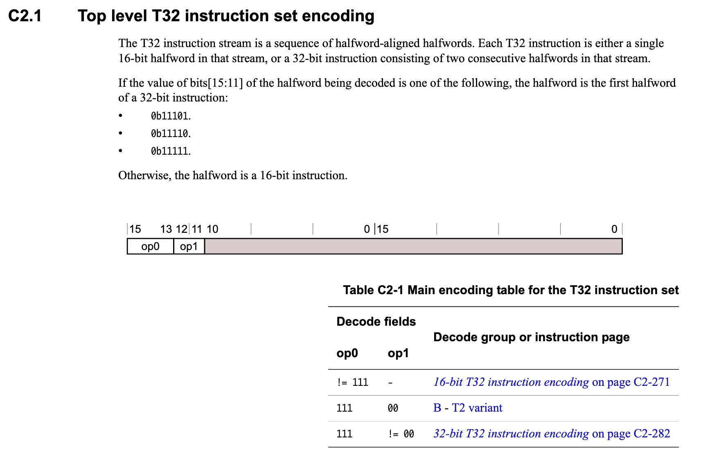
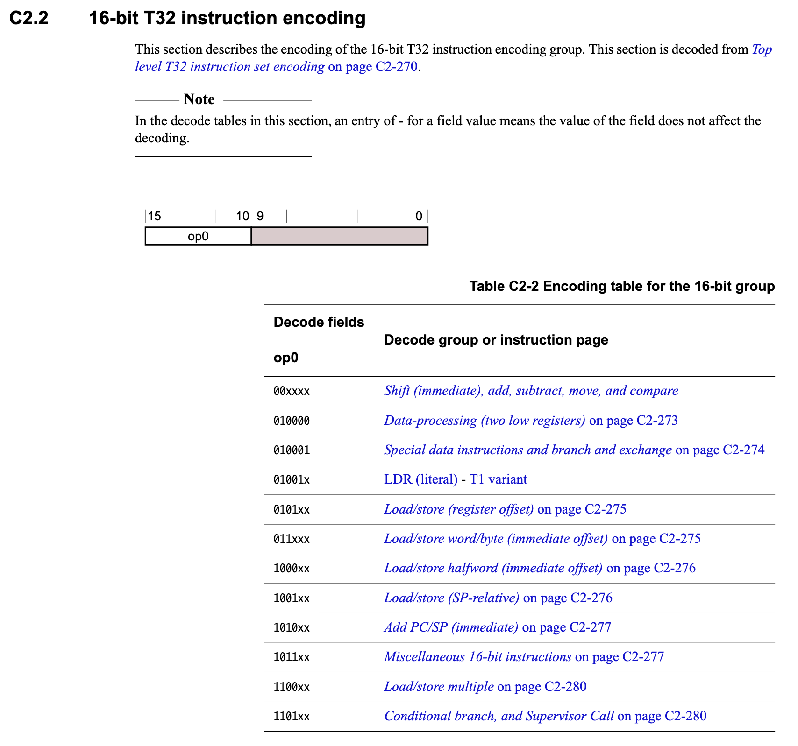
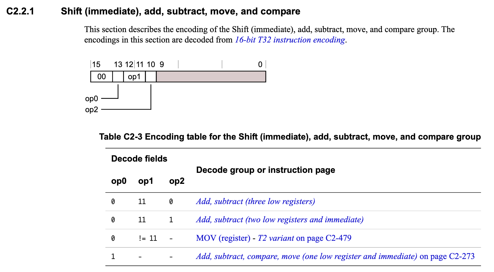
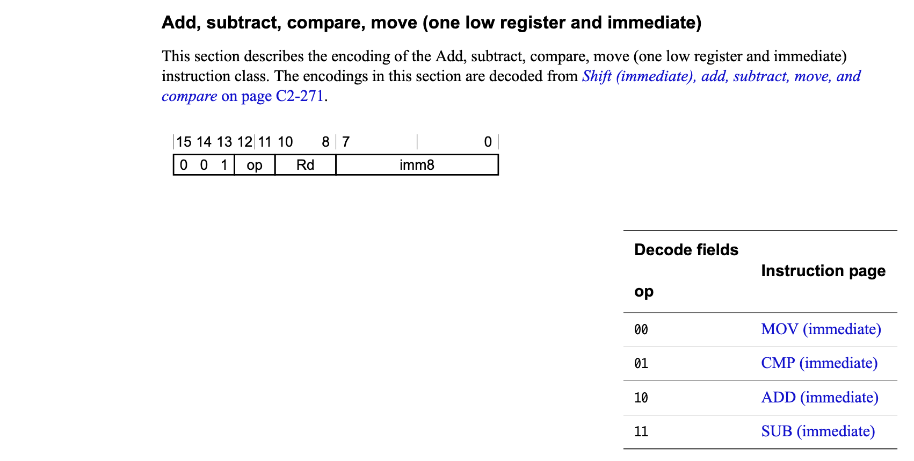
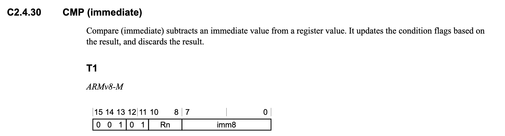

# ARM THUMB Assembly to Machine Code

## Prerequisites

Depending on the ARM Cortex-M device being used, the appropriate ARM
Architecture Reference Manual is a must-have. We'll be using the
ARMv8-M manual here since the NXP LPC55S69 is an ARM Cortex-M33.

| Instruction Set    | Associated ARM Cortex Device(s) |
| ------------------ | ------------------------------- |
| ARMv6-M (Thumb)    | ARM Cortex M0, ARM Cortex-M0+   |
| ARMv7-M (Thumb-2)  | ARM Cortex-M3                   |
| ARMv7E-M (Thumb-2) | ARM Cortex M4(F), ARM Cortex M7 |
| ARMv8-M (Thumb-2)  | ARM Cortex M23, ARM Cortex M33  |

The appropriate document can be accessed from the list below:

- [ARM v6-M Architecture Reference Manual](https://static.docs.arm.com/ddi0419/d/DDI0419D_armv6m_arm.pdf)
- [ARM v7-M Architecture Reference Manual](https://static.docs.arm.com/ddi0403/eb/DDI0403E_B_armv7m_arm.pdf)
- [ARM v8-M Architecture Reference Manual](https://static.docs.arm.com/ddi0553/a/DDI0553A_e_armv8m_arm.pdf)

## Example: `cmp`

Based on the code snippet below, we'll discuss how to map `0x2900` (machine
code) to `cmp r1, #0` (assembly) and back again, looking up the `cmp`
THUMB command in the ARMv8-M architecture reference manual:

```
     134:	2900      	cmp	r1, #0
     136:	bf08      	it	eq
     138:	2800      	cmpeq	r0, #0
     13a:	bf1c      	itt	ne
```

### Functionality

According to section 2.4.30 of the ARMv8-M ARM, `CMP` for THUMB has the
following functionality:

    Compare (immediate) subtracts an immediate value from a register value.
    It updates the condition flags based on the result, and discards the
    result.

What this means is that this instruction compares a general-purpose register
value (`r1` in the first case) with the second immediate value (`#0` here),
after subtracting the immediate value from the value in Rn. This is the same
as a SUBS instruction, except that the result is discarded.

The N, Z, C and V condition flags will be updated based on the result, but the
results are not placed in any register.

### Syntax

`CMP{<c>}{<q>} <Rn>, #<imm8>`

- `c`: Optional condition code suffix
- `q`:
- `Rn`: The general-purpose register (R0, R7, etc.)
- `imm8`: The immediate value operand

### Machine Code

| 15 | 14 | 13 | 12 | 11 | 10 | 09 | 08 | 07 | 06 | 05 | 04 | 03 | 02 | 01 | 00 |
| -- | -- | -- | -- | -- | -- | -- | -- | -- | -- | -- | -- | -- | -- | -- | -- |
|  0 |  0 |  1 |  0 |  1 | Rn | Rn | Rn | IM | IM | IM | IM | IM | IM | IM | IM |

#### Machine Code (De)Construction

The following tables from the ARMv8-M Architecture Reference Manual show how
the machine code is assembled (and disassembled!):

We know that this is a 16-bit THUMB instruction (not a 32-bit one) due to the
first three bits not being 111:



From here we can decode the exact THUMB command and parameter values.
Screenshots of the key tables are reproduced below for convenience sake.






### Breakdown

Based on the above tables, we can then correlate our machine code with the
assembly instructions, and vice versa.

#### `cmp	r1, #0`

- Binary = `0010 1001 0000 0000`
- Hexadecimal = `0x2900`

| Bits  | Value    | Description |
| ----- | -------- | ----------- |
| 15-14 | 00       | Shift (immediate), add, subtract, move, and compare (C2.2.1) |
| 13    | 1        | Add, subtract, compare, move (one low register and immediate)|
| 12-11 | 01       | CMP (immediate) |
| 10-8  | 001      | Rn = R1 |
| 7-0   | 00000000 | 0 (Literal value) |

#### `cmpeq	r0, #0`

- Binary = `0010 1000 0000 0000`
- Hexadecimal = `0x2800`

| Bits  | Value    | Description |
| ----- | -------- | ----------- |
| 15-14 | 00       | Shift (immediate), add, subtract, move, and compare (C2.2.1) |
| 13    | 1        | Add, subtract, compare, move (one low register and immediate)|
| 12-11 | 01       | CMP (immediate) |
| 10-8  | 000      | Rn = R0 |
| 7-0   | 00000000 | 0 (Literal value) |

We should note that this instruction also has the `eq` (Equal) condition code
suffix, though. This clearly isn't encoded in machine code calculations above,
so how is that stored?
